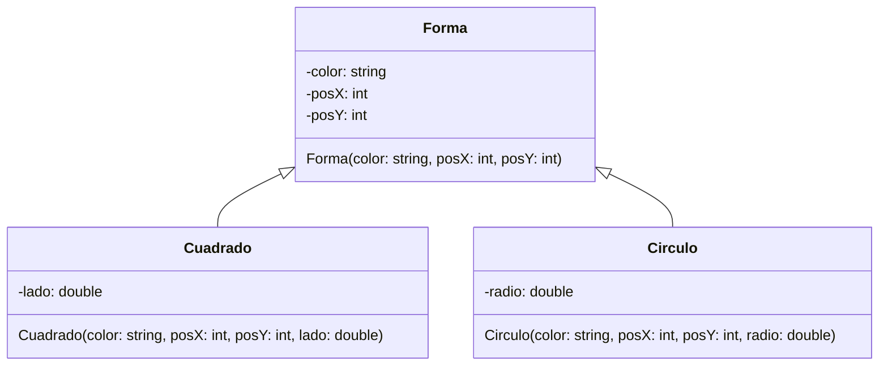

```mermaid
classDiagram
    class Forma{
        -color: string
        -posX: int
        -posY: int
        Forma(color: string, posX: int, posY: int)
    }

    class Cuadrado{
        -lado: double
        Cuadrado(color: string, posX: int, posY: int, lado: double)
    }
    Forma <|-- Cuadrado

    class Circulo{
        -radio: double
        Circulo(color: string, posX: int, posY: int, radio: double)
    }
    Forma <|-- Circulo
```